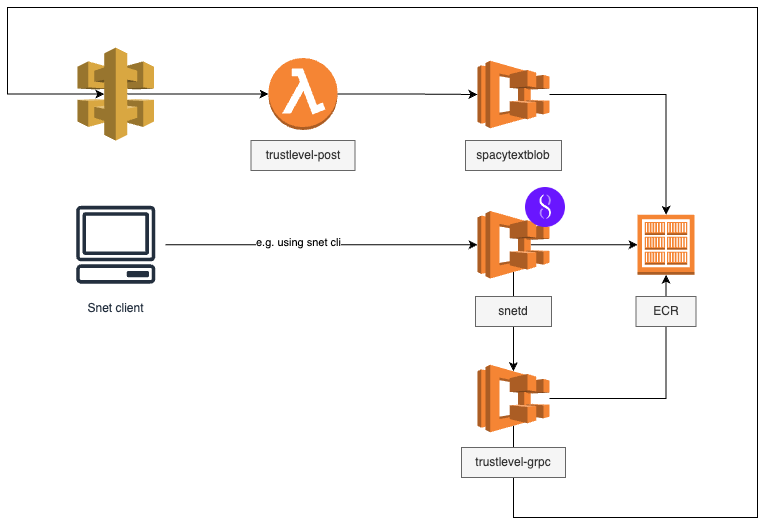

[](https://github.com/google/gts)

# Trustlevel-Webstack

The following diagram shows Trustlevel main infrastructure components:



* [**snetd**](docker/snetd/README.md) [Singularity.net](https://dev.singularitynet.io/docs/ai-developers/daemon-setup/) deamon. Sidecar service/proxy that receives [snet service](https://docs.google.com/document/d/1jkkIMvUObSc81Cv3WXl9wtjFwt-itFSaOctyGdPg_30/edit#heading=h.uuy5v21gphhh) calls. Handles blockchain related part of service calls before forwarding the request to the trustlevel-grpc
* [**trustlevel-grpc**](docker/grpc-service/README.md) grpc service that calls trustlevel api to calculate trustlevel value for a given text
* [**trustlevel-post**](workspaces/apis/trustlevel-api/README.md) the trustlevel calculation api. A lambda function that orchestrates trustlevel value calculation combining multiple AI serices (for now spacytextblob only)
* [**spacytextblob**](docker/spacytextblob/README.md) AI service that analyzes text and returns a set of values such as subjectivity and polarity scores.


The api project contains trustlevel components linked together using [yarn workspaces](https://classic.yarnpkg.com/en/docs/workspaces/).


# Execution (top level)

```bash
# install and link all dependencies
yarn install

# prettify/lint all projects
yarn run fix
```

# Deployment

Find deployment instructions here:
[Cdk deployment](/workspaces/cdk/README.md)

## AWS Credentials and 1Password
If you want to use 1Password to securely use AWS Credentials on your local machine, follow the instructions [here](https://developer.1password.com/docs/cli/shell-plugins/aws/).

```bash
# add to ~/.aws/config to please AWS_PROFILE settings
[profile trustlevel]
region = eu-west-1

# For temporary terminal sessions - add to ~/.zsrhc
alias trustlevel="source ~/.config/op/plugins.sh" # activate 1Password aws plugin for current terminal session

# For global terminal session add to ~/.zsrhc
source ~/.config/op/plugins.sh
```


# Trustlevel Api

Once the stack is deployt, you can call the trustlevel api as follows:

1. Copy the text you want to determine the `trustlevel` for
2. Escape the text so that you can paste it into a json attribute (here are some example tools that do the work for you: [online formatter](https://www.freeformatter.com/json-escape.html#before-output) or [jq](https://jqlang.github.io/jq/))
3. Call the trustlevel api (curl example):

   ```bash
   curl --location 'https://<stage-url>/v1/trustlevels/' \
   --header 'Content-Type: application/json' \
   --header 'x-api-key: <stage-api-key>' \
   --data '{
       "text": "<your-escaped-text>"
   }'
   ```

# Snet calls

## Prerequisites

1. [snet-cli](https://github.com/singnet/snet-cli) installation (c.f.: [snet-poc](https://github.com/TrustLevel/snet-poc?tab=readme-ov-file#snet-cli))
1. Metamask wallet with some tokens (mainnet or goerli)

## Execution

```bash

# create your identiy (e.g. using goerli testnet; you can also select mainnet, but it would involve real tokens)
snet identity create <name-of-your-identity> key --private-key <metamask-private-key> --network goerli

# switch to the identity you want to use
snet identity <name-of-identity>

# Create a deposit for service executions
# Note setting --gas-price may help you to overcome execution errors
snet account deposit 10.0

# Create a channel for service executions (example org-id = trustlevel-aws-test)
snet channel open-init <org-id> default_groups 10.0 +2days

# Execute the example service
# (example org-id = trustlevel-aws-test)
# (example service-id = trustlevel-aws-service-test-4)
snet client call <org-id> <service-id> default_groups determineTrustLevel '{"input_string":"Witnesses and some local journalists say that at least four Israeli missiles struck three buildings inside the Jabalia refugee camp last night. The Hamas-run health ministry in Gaza says 110 people were killed"}'
```